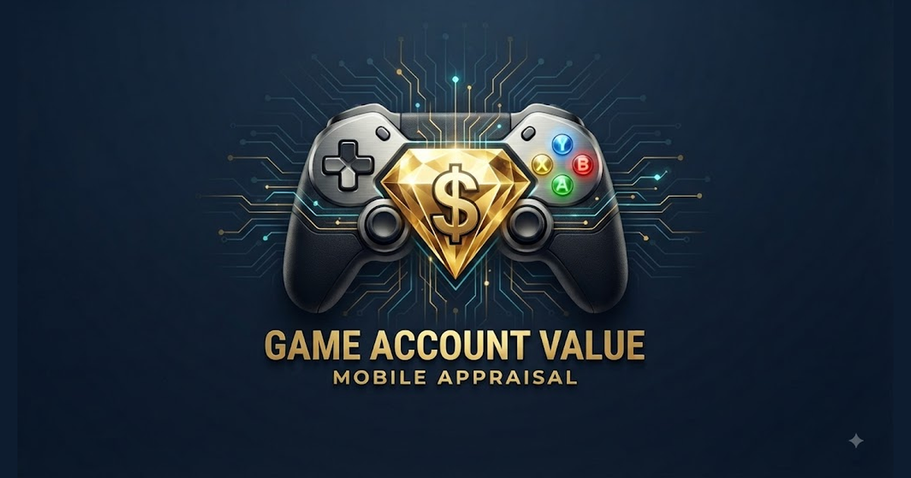
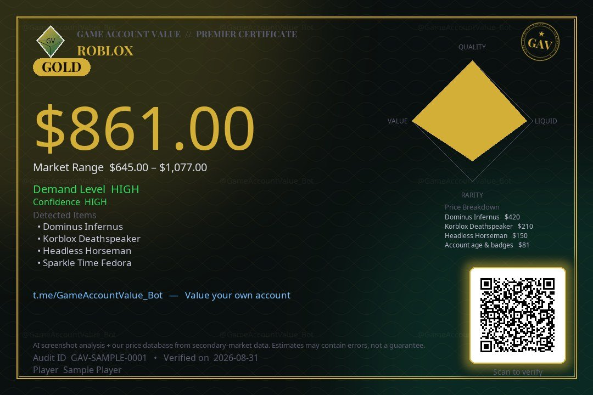

<p align="center">
  
</p>

<h1 align="center">GameAccountValue</h1>
<p align="center"><strong>Landing page for an AI-powered game account appraisal bot — not a marketplace, an independent estimate.</strong></p>

<p align="center">
  
  <a href="LICENSE"></a>
  
  
</p>

<p align="center"><strong>🔗 Live: <a href="https://iamalex-afk.github.io/game-account-value/">iamalex-afk.github.io/game-account-value</a></strong></p>
<p align="center">Bot: <a href="https://t.me/GameAccountValue_Bot">@GameAccountValue_Bot</a></p>

---

## What it is

Landing page for **[@GameAccountValue_Bot](https://t.me/GameAccountValue_Bot)**, a Telegram bot that gives an independent, AI-generated market value estimate for game accounts. Send screenshots of your inventory — the bot's AI vision reads them like a human appraiser and returns a price range plus a verifiable PDF certificate.

Supported games: Roblox, Brawl Stars, Clash of Clans, Clash Royale, Free Fire, Genshin Impact, Mobile Legends, Fortnite, Minecraft.

<p align="center">
  
  <br><em>Example certificate — sample data</em>
</p>

## What it's not

- **Not a marketplace.** We don't buy, sell, or broker accounts — only estimate their value.
- **Not a data harvester.** Screenshots are processed in RAM only and discarded after analysis; user IDs are SHA-256 hashed, never stored raw.

## Features

- ✅ **15 languages**: en, ru, es, pt, id, tr, ar, vi, hi, fr, de, it, ja, ko, th
- ✅ **Dual currency** — prices shown in USD and the visitor's local currency
- ✅ **Verifiable PDF certificates** — unique Audit ID + QR code for instant authenticity checks
- ✅ **Installable PWA** with offline support
- ✅ **Lighthouse 100 / 100 / 100 / 100** — Performance, Accessibility, Best Practices, SEO

## Tech stack

Vanilla JavaScript, HTML, CSS. No frameworks, no bundler. Fully static, deployed as-is to GitHub Pages.

## Structure

```
index.html                  homepage (English)
{lang}/index.html            localized versions: ru, es, pt, id, tr, ar, vi, hi, fr, de, it, ja, ko, th
privacy.html, terms.html     legal pages
robots.txt, sitemap.xml      SEO
llms.txt, ai.txt             structured info for AI crawlers/agents (JSON-LD also embedded inline)
manifest.json, favicon.svg/.png, og-image.png   PWA manifest and social preview
.well-known/security.txt, SECURITY.md
sw.js                        service worker — offline support, installable PWA
```

## Run locally

No build step — just serve the directory:

```bash
python -m http.server 8080
# open http://localhost:8080
```

## License

GPL-3.0 — see [LICENSE](LICENSE). © 2026 Aleksei Sergeevich Bitkin.
