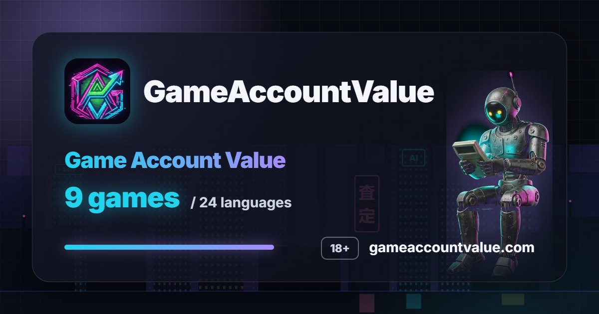
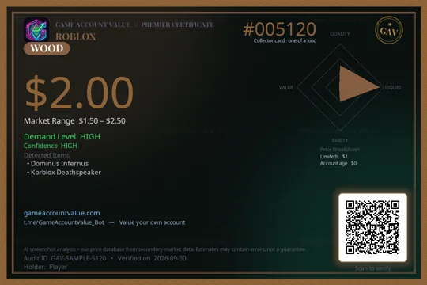
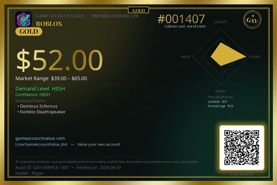
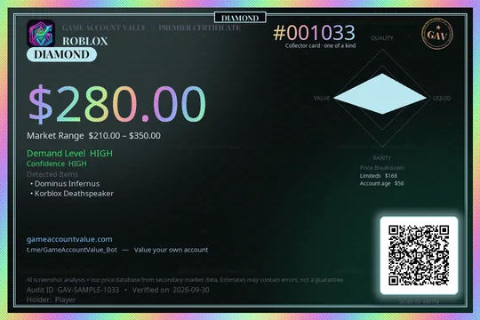
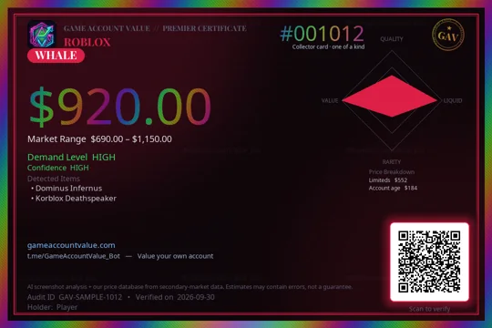

<p align="center">
  
</p>

<h1 align="center">GameAccountValue</h1>

<p align="center"><strong>Independent AI estimate of what a game account is worth — in 24 languages.<br>Not a marketplace: we never buy, sell or broker accounts.</strong></p>

<p align="center">
  <a href="https://gameaccountvalue.com/"></a>
  <a href="https://t.me/GameAccountValue_Bot"></a>
  
  
  
  <a href="LICENSE"></a>
</p>

---

## In one minute

**The question:** *"How much is my Roblox / Fortnite / Genshin account actually worth?"*
Marketplaces show asking prices, not what accounts sell for, and every seller's listing is optimistic.

**What we do:**
1. **On the site** — a free calculator per game gives a rough range right in the browser. Nothing is typed into a server, nothing is sent anywhere.
2. **In the Telegram bot** — send 1–3 screenshots. AI vision reads the inventory (rare items, skins, levels), compares it with dated market reference points and returns a price range, a confidence level and a liquidity rating.
3. **Paid full audit** — adds a verifiable PDF **collector card** with a QR check and a short 3D tilt video.

**What we don't do:** trade accounts, ask for logins, store screenshots, or scrape marketplaces.

## The collector card

<p align="center">
  
  
  
  
  <br><em>Sample data. Foil follows the estimated value: WOOD → IRON → BRONZE → SILVER → GOLD → PLATINUM → EMERALD → DIAMOND → WHALE.</em>
</p>

- **Numbered from #1**, one sequence for everyone. Cards **#1–100 are GENESIS**, **#101–1000 FOUNDER**.
- **Tamper-evident:** the number, edition, tier and price are inside the checksummed card data, so an edited PDF no longer matches its QR verification page.
- **Honest by design:** the tier is computed from the estimate — no random drops, no loot boxes. Cards are not transferable and have **no monetary value**; they are not an investment.

## Supported games

Roblox · Brawl Stars · Clash of Clans · Clash Royale · Free Fire · Genshin Impact · Mobile Legends · Fortnite · Minecraft

Each game has its own page: calculator, dated price ranges with sources, what raises or lowers value, scam risks and platform rules.

## Languages

English, Русский, Español, Português, Bahasa Indonesia, Türkçe, العربية, Tiếng Việt, हिन्दी, Français, Deutsch, Italiano, 日本語, 한국어, ภาษาไทย, Polski, 中文, Filipino, Kiswahili, Bahasa Melayu, Oʻzbekcha, Қазақша, Türkmençe, Кыргызча.

Every language has the same **15 pages** (home, 9 game reports, market report, most-valuable-accounts comparison, trading safety guide, glossary, methodology), written as adapted translations with local number formats — not machine dumps. Language versions are linked with `hreflang` and a visible language switcher; there is no automatic redirect by IP.

English additionally has the news section (hub + 9 game news pages), privacy policy and terms. Their translation is in progress — see the plan in [SITE-STANDARD.md](SITE-STANDARD.md).

## Privacy in plain words

- The site calculator runs **entirely in your browser**.
- The bot processes screenshots **in memory only** and discards them after the analysis.
- Telegram user IDs are **stored as SHA-256 hashes**, never raw.
- No third-party analytics are wired up; CTA buttons carry a no-op `data-event` hook only.

Full text: [privacy.html](https://gameaccountvalue.com/privacy.html) · [terms.html](https://gameaccountvalue.com/terms.html)

## Quality, measured

| Check | Result (2026-09-30) |
|---|---|
| Lighthouse mobile, live homepage | Performance 96 · Accessibility 100 · Best Practices 100 · SEO 100 |
| `python scripts/site_check.py` | 373 pages, 0 errors (links, JSON-LD, canonical, hreflang, required blocks) |
| Layout | no horizontal scroll at 360 / 390 / 768 / 1280 px, including right-to-left Arabic |
| Security headers | strict CSP (`script-src 'self'`), [security.txt](.well-known/security.txt), [SECURITY.md](SECURITY.md) |

## Tech

Plain HTML, CSS and JavaScript — no framework, no bundler, no build step. Deployed as static files to GitHub Pages on the custom domain.
Installable PWA with a service worker (shell precache, network-first for CSS/JS so updates arrive immediately).

```
index.html, {game}.html          English homepage + 9 game reports
market-report.html, methodology.html, glossary.html,
account-trading-safety.html, which-game-accounts-are-most-valuable.html
news.html, {game}-news.html      news hub + per-game news (English for now)
{lang}/                          the same 15 pages in each of the 23 other languages
assets/glass.css                 design system, built from scripts/design/css/*.css
assets/calculators.js            per-game calculators; every price anchor is sourced in a comment
assets/cards/{lang}/             collector card samples rendered by the bot's own card drawer
sitemap.xml, robots.txt          SEO; llms.txt, ai.txt — plain-text summary for AI assistants
scripts/site_check.py            one-command quality gate
```

## Run locally

```bash
python -m http.server 8080
# open http://localhost:8080
```

## Publishing a new page

1. Add it to `sitemap.xml`, commit, then `python scripts/sitemap_lastmod.py` (lastmod from git history).
2. `python scripts/site_check.py` must report **0 errors**.
3. After the GitHub Pages run succeeds: `python scripts/indexnow.py https://gameaccountvalue.com/<page>.html` (Bing, Yandex and other IndexNow members) and URL Inspection in Google Search Console.

## Working standard

Every change follows [SITE-STANDARD.md](SITE-STANDARD.md): full translation in all 24 languages, primary sources only, screenshots at 390/1280 px, push → successful Pages run → live check, Lighthouse mobile ≥ 90.

## Author and license

Made by **Aleksei Bitkin**. Code under **GPL-3.0** — see [LICENSE](LICENSE). © 2026.
Game names and trademarks belong to their owners; GameAccountValue is not affiliated with any game publisher or marketplace.
